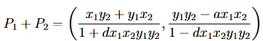

# Algoritmo de Dobra e Soma em Curvas de Edwards

## 📝 Descrição
Este trabalho prático tem como objetivo implementar o Algoritmo de Dobra e Soma para realizar multiplicaçõoes escalares eficientes em curvas de Edwards. As curvas de Edwards são uma forma de curva elíptica com propriedades aritméticas interessantes, particularmente no que diz respeito à completeza da lei de grupo.

---

### Curvas de Edwards
Uma curva de Edwards sobre um corpo Fp é definida pela equação:

ax² + y² = 1 + dx²y²

onde a, b, d ∈ Fp são constantes que satisfazem certas condições para garantir que a curva seja não-singular e completa.

---

### Lei do Grupo
A lei de grupo para a adição de dois pontos P1 = (x1, y1) e P2 = (x2, y2) em uma curva de Edwards é dada por:

O ponto neutro da curva de Edwards é O = (0, 1)

---

### Algoritmo de Dobra e Soma
O algoritmo de Dobra e Soma é um método eficiente para calcular o múltiplo escalar de um ponto em uma curva elíptica. Dado um ponto P e um inteiro n, o algoritmo calcula nP da seguinte forma:

1. Escreva **n** em sua representação binária: n = (bk bk−1 . . . b1 b0)2.
2. Inicialize R = O.
3. Para i de k até 0:
    - R = R + R (Duplicação)
    - Se bi = 1, então R = R + P (Adição)
4. Retorne R

---

## 🛠️ Ferramentas utilizadas
- Linguagem Python.
- Matplotlib.
- Numpy.

---

## ⚙️ Funcionalidades
- Lei de Grupo: implementa a operação de adição de dois pontos P1 e P2;
- Conversão pra base binária: converte o inteiro fornecido pelo usuário para binário;
- Algoritmo de Dobra e Soma: calcula o múltiplo escalar de um ponto P por um inteiro n.
- Gráfico da curva e pontos: gera um gráfico que exibe a curva a partir das entradas fornecidas e com os pontos P e nP.

---

## 🧠 Como funciona
O programa executa os seguintes passos:

1. Recebe como entrada os parâmetros da curva de Edwards (a, b, d), um ponto P = (x, y) na curva (ou seja, satisfaz a equação: ax² + by² = 1 + dx²y²) e um inteiro n;
2. Implementa a lei de grupo para a adição de pontos em curvas de Edwards;
3. Implementa algoritmo de Dobra e Soma para calcular nP;
4. Retorna as coordenadas do ponto nP.
